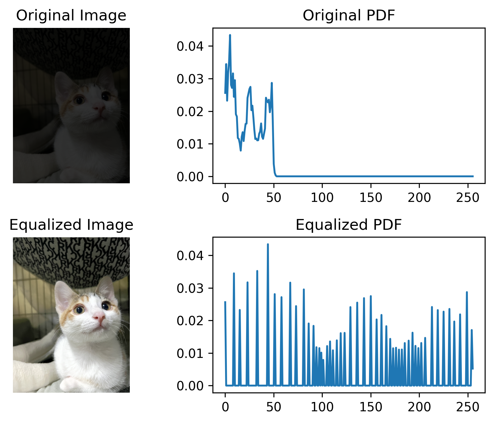

# Image Processing HW1 with Histogram Equalization

This project demonstrates the use of histogram equalization to enhance the contrast of an image. The process involves reading an image, converting it to the HSV color space, equalizing the histogram of the V (value/brightness) channel, and then converting the image back to the BGR color space for display and saving.

## Requirements

- Python 3.x
- OpenCV
- NumPy
- Matplotlib

## Installation

1. Clone the repository:
    ```sh
    git clone https://github.com/CosineYu2002/ImageProcessing_hw1.git
    cd ImageProcessing
    ```

2. Install the required packages using `requirement.txt`:
    ```sh
    pip install -r rquirement.txt
    ```

## Usage

1. Place your input image in the project directory and name it `input.png`. (Note: The input image is not included in the repository. Please use your own image.)

2. Run the `hist.ipynb` notebook to perform histogram equalization and visualize the results:
    ```sh
    jupyter notebook hist.ipynb
    ```

3. The notebook will:
    - Read the input image and convert it to the HSV color space.
    - Split the HSV image into its H, S, and V channels.
    - Compute the histogram, PDF, and CDF of the V channel.
    - Normalize the CDF and map the original pixel values to new intensity values.
    - Merge the H, S, and equalized V channels back into an HSV image.
    - Convert the equalized HSV image back to the BGR color space and save it as `output.png`.
    - Display the original and equalized images, as well as their PDFs, in a 2x2 subplot.
    - Save the subplot as `result.png`.

4. If you don't know how to use the Jupyter notebook, you can also use `hw1.py`. It will generate the same result.

## Example

Here is an example of the output:

